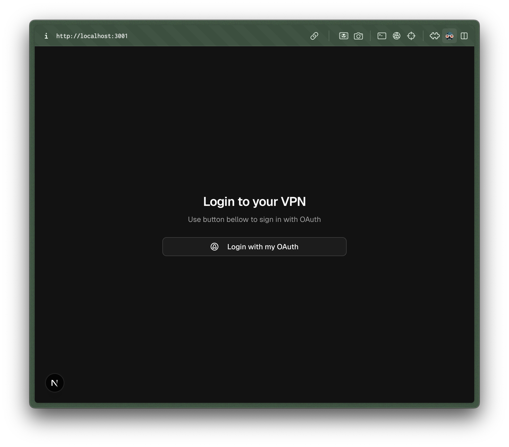
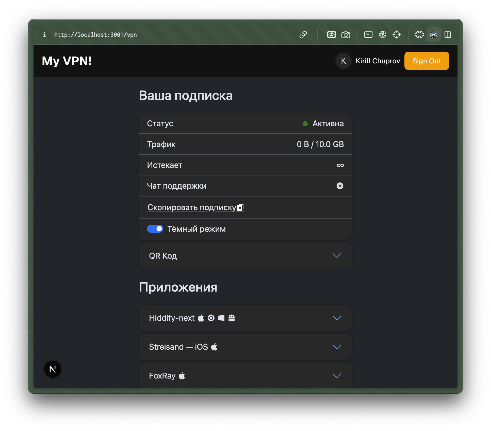

# OAuth VPN Portal

A Next.js application that provides OAuth-based authentication for Marzban VPN service. This portal automatically creates new VPN subscriptions for authenticated users through OAuth. After loging in users will see your subscription template from your marzban server.

## Features

- OAuth-based authentication using BetterAuth
- Automatic VPN subscription creation for authenticated users
- Modern UI built with Next.js and Tailwind CSS
- PostgreSQL database integration for user management
- Secure configuration management
- TypeScript support

## Screenshots

### Login Page


### Main Page


## Prerequisites

- Node.js (Latest LTS version recommended)
- PostgreSQL database 
- Marzban VPN server instance

## Installation

1. Clone the repository:

2. Install dependencies:
```bash
bun i
```

3. Set up environment variables:
   - Copy `.env.example` to `.env`
   - Fill in the required environment variables:
     - `BETTER_AUTH_SECRET`: Secret key for auth. It is recomenended to generate new random string with `openssl rand -hex 32`
     - `DATABASE_URL`: PostgreSQL connection string
     - `OPENID_CLIENT_ID`: Your OAuth client ID
     - `OPENID_CLIENT_SECRET`: Your OAuth client secret
     - `OPENID_DISCOVERY_URL`: Well-known OpenID configuration URL
     - `MARZBAN_API_URL`: API URL of your Marzban VPN server. Usually the same as `NEXT_PUBLIC_MARZBAN_INSTANCE_URL`
     - `MARZBAN_USERNAME`: Marzban admin username
     - `MARZBAN_PASSWORD`: Marzban admin password
     - `NEXT_PUBLIC_LOGIN_BUTTON_TEXT`: Custom text for the login button
     - `NEXT_PUBLIC_MARZBAN_INSTANCE_URL`: Public URL of your Marzban instance. Without trailing slash.
     - `NEXT_PUBLIC_PAGE_TITLE`: Title of the portal page

4. Migrate the database
```bash
bunx @better-auth/cli migrate
```

## Marzban Inbound configuratio

If you didn't touch your inbounds you can skip this section.

By default, `oauth-vpn-portal` will try to fetch all available inbouds from your marzban instance on startup and will keep it. It will be used for all new subscriptions. If you changed your inbound configuration, make sure to restart `oauth-vpn-portal`.

<!-- You can specify `MARZBAN_USER_INBOUNDS` enviroment value with stringified json configuration of inbounds for new users if you don't want use all available inbounds. -->

## Database

You will need a PostgreSQL database running somewhere to store logined users. You can run free postgres on https://neon.tech/, it will be enought.

## Development

Start the development server:

```bash
bun dev
```

The application will be available at `http://localhost:3000`.

## Building for Production

1. Build the application:
```bash
bun run build
```

2. Start the production server:
```bash
bun start
```


## License

This project is licensed under the MIT License - see the LICENSE file for details.